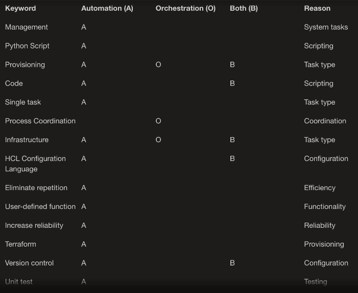

#  Automation and Orchestration

##  Exercise 1: Research Automation/Orchestration

 ### - Management  -  Automation  -  Typically falls under automation as it involves tasks like system and resource management.

 ### - Python Script  -  Automation  -  Used for automating tasks, falls under automation.

 ### - Provisioning   -  Both  -  Can be automated (A) for single tasks, or orchestrated (O) for coordinating multiple tasks.

 ### - Code   -  Both  -  Used in automation (A) for writing scripts, and in orchestration (O) for defining workflows.

 ### - Single task  -  Automation  -  Automation typically deals with automating individual tasks.

 ### - Process Coordination  -  Orchestration  -  Core aspect of orchestration as it involves coordinating multiple processes or tasks.

### - Infrastructure   -  Both  -  Can be automated (A) for single tasks, or orchestrated (O) for managing complex infrastructure.	

### - HCL Configuration Language  -  Orchestration  -  HCL (HashiCorp Configuration Language) is often used in orchestration tools like Terraform for defining and managing infrastructure

### - Eliminate repetition  -  Automation  -  A key goal of automation is to eliminate repetitive tasks. 	

### - User-defined function  -  Automation  -  Used in automation for creating custom functions.

### - Increase reliability  -  Automation  -  A key goal of automation is to improve reliability.			

### - Terraform  -  Automation  -  Used for automating the provisioning of infrastructure.	

### - Version control   -  Both  -  Both automation and orchestration can benefit from version control, as it helps manage changes in code or configurations.		

### - Unit test  -  Automation  -  Used in automation for testing individual units of code.

### - Decrease IT cost  -  Automation  -  A key goal of automation is to reduce operational costs.	

### - Thread creation  -  Automation  -  Related to automation, involves creating threads for parallel execution.		
	
### - Decrease friction among teams  -  Orchestration  -  Orchestration helps in coordinating tasks across different teams or departments, reducing friction.				

### - Increase productivity   -  Both  -  Both automation and orchestration contribute to increased productivity by streamlining processes and reducing manual effort.

### - PyCharm  -  Automation  -  PyCharm is an Integrated Development Environment (IDE) often used for writing and executing Python scripts, which are commonly used in automation.

### - Workflow  -  Orchestration  -  Orchestration is concerned with defining and managing workflows, which involve the coordination of multiple tasks or processes.

 ##  Exercise 2: Compare and Contrast ..
 

 

 ## ROOM 3 : Isra, Sahil, Artur , Maz